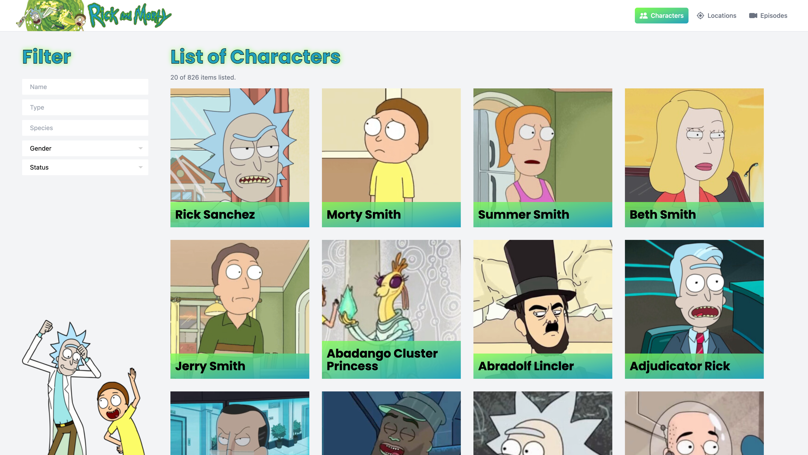
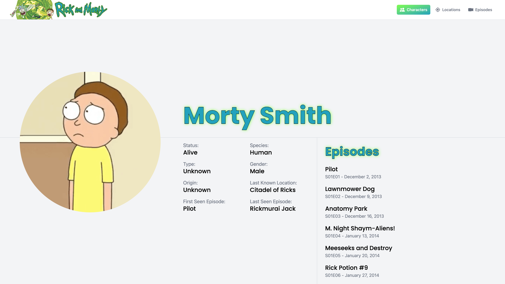
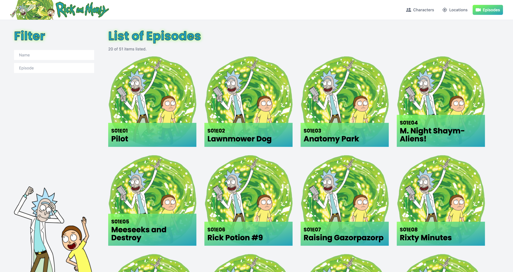
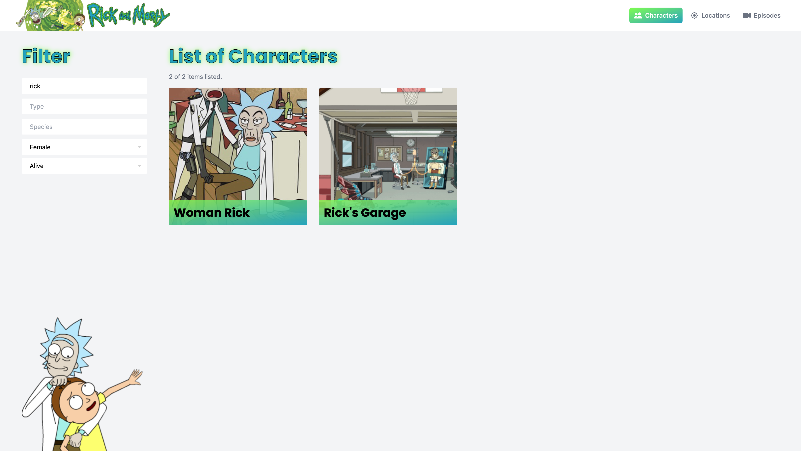
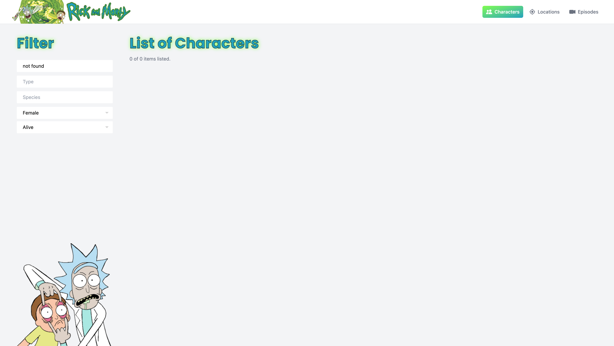
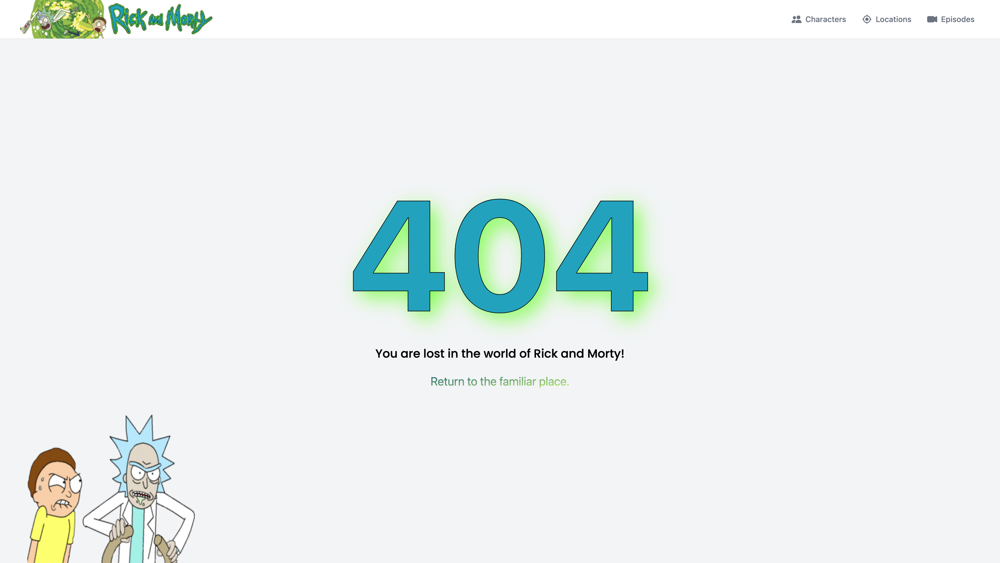

# Rick and Morty Wiki

This project includes listing, filtering and showing details of Rick and Morty data fetched from API. It is a Astro project.

## Using Packages

- astrojs
- nanostores
- react-infinite-scroll-component
- jest
- react-testing-library
- sass
- tailwindcss

## Installation

You can download the project by cloning it from the Github site or by typing the following command:

```console
git clone https://github.com/baspinarenes/rick-and-morty-wiki
```

## Run Project

In the project directory you can run the following lines:

```console
npm install
npm start
```

## Screenshots







